https://console.firebase.google.com/

### home - выбор рабочей базы
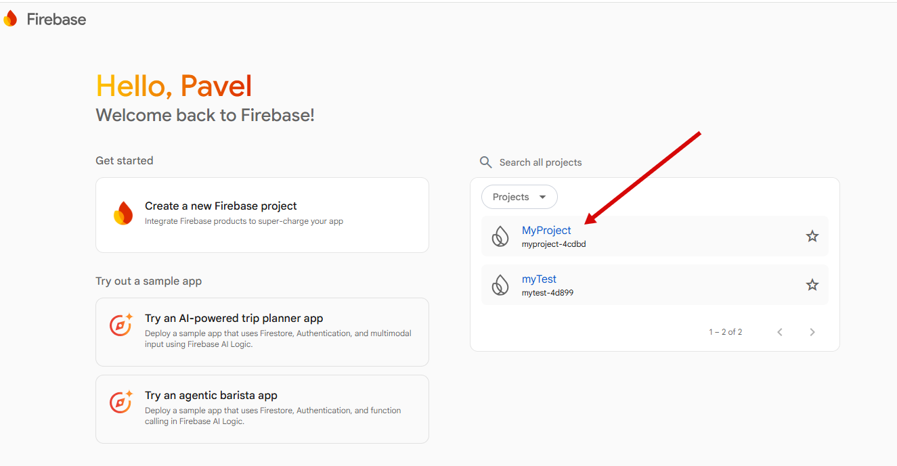

### firebase управление базой
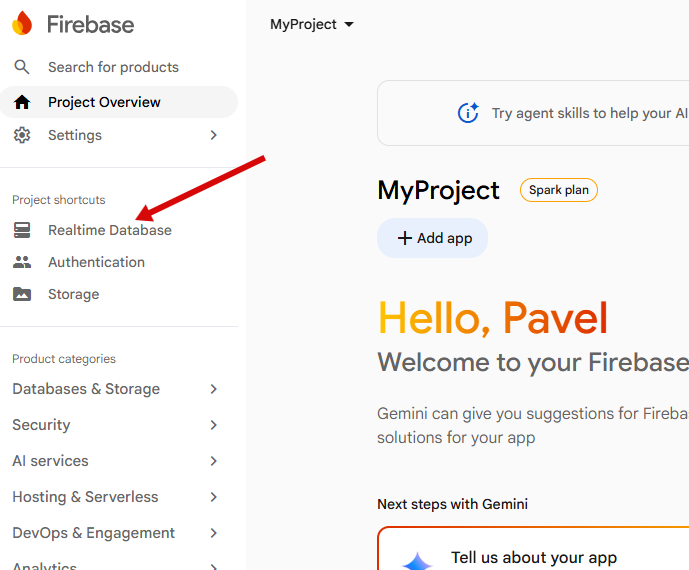

### firebase создание базы
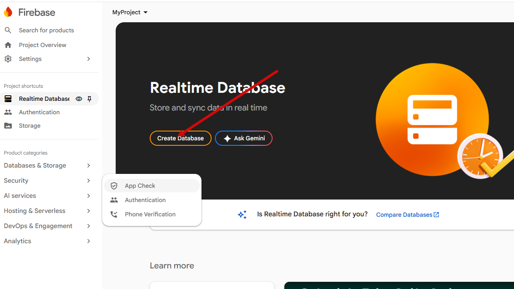

### firebase  создание базы2
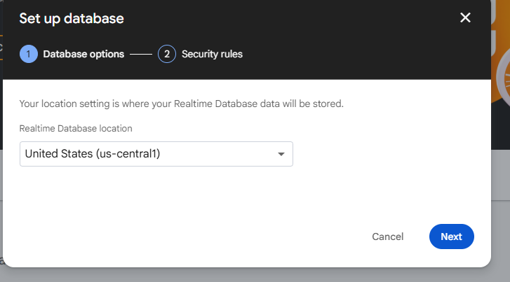

### firebase  создание базы3
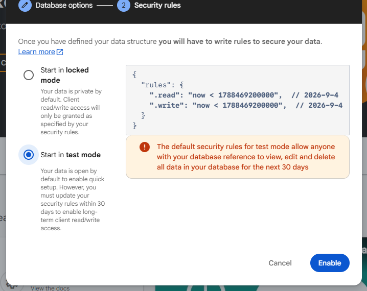

### firebase   создание базы4 готово
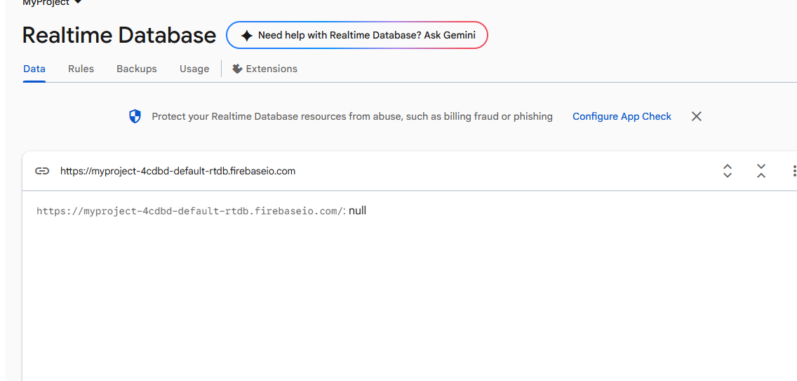

### firebase  наполнение данными из файла
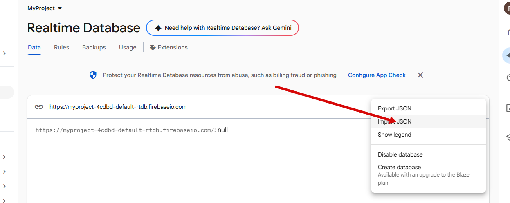

### firebase наполнение данными из файла готово
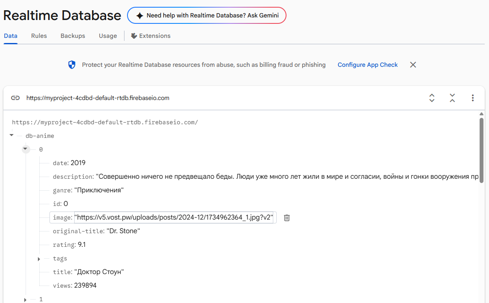

### firebase конфигурация доступа
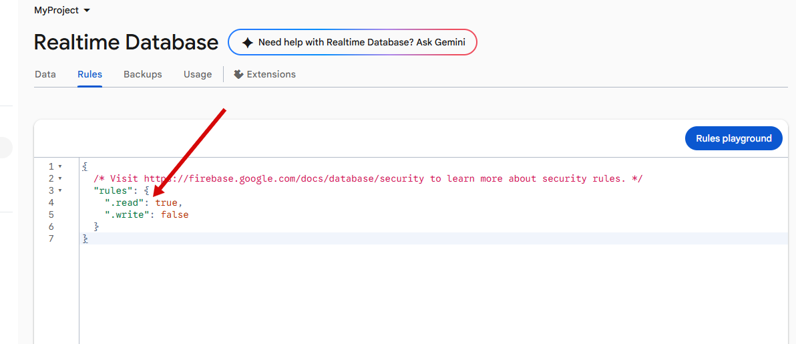
```json
вариант конфигурации
{
  "rules": {
    //".read": "now < 1762549200000",  // 2025-11-8
    //".write": "now < 1762549200000",  // 2025-11-8
    ".read": true,
    ".write": false,
    "goods": {
      ".indexOn": ["title", "price", "category"]
    }      
  }
}
```


### firebase получение ссылки для доступа к данным
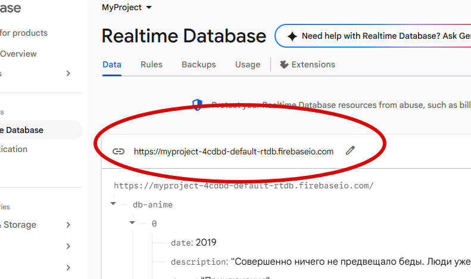

### firebase мой вариант ссылки:
```
https://myproject-4cdbd-default-rtdb.firebaseio.com/db-anime.json
```


### firebase данные получаемые по этой ссылке;
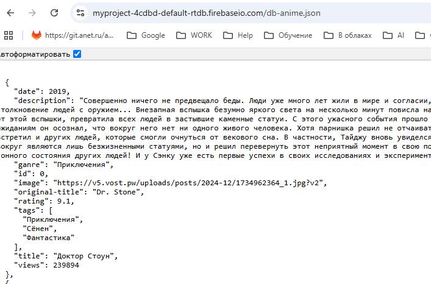

